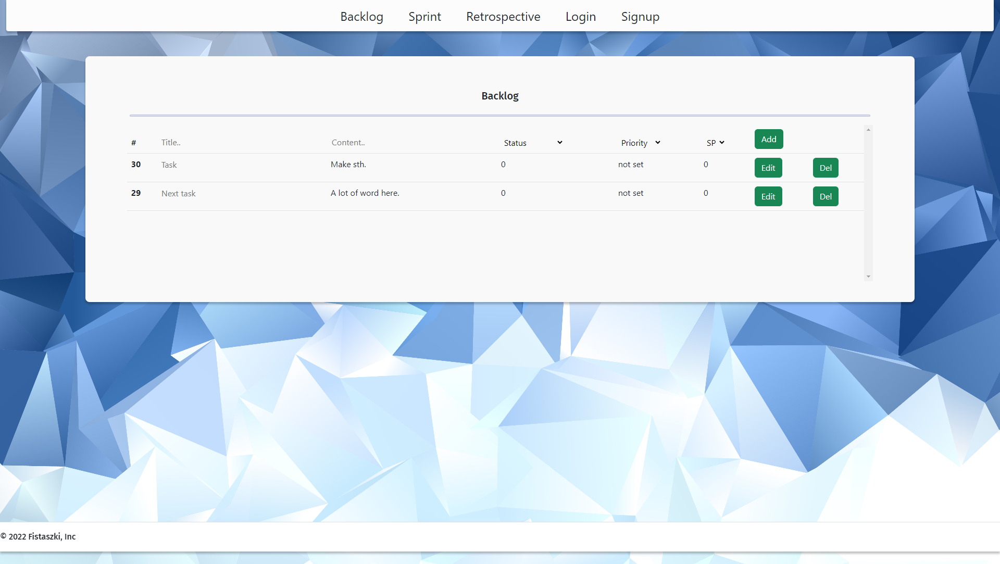
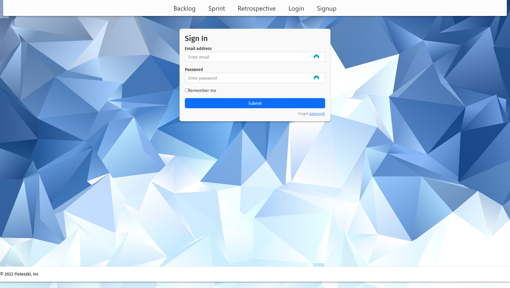

# Scrum App
  Prototyp aplikacji do zarządzania zadaniami na podstawie zwinnej metodyki Scrum. <br>
  Do utworzenia aplikacji zostały wykorzystane następujące technologie: <br>
  * Backend - .Net Rest API
  * Frontend - React
    
## Spis treści
* [Informacje ogólne](#Informacje-ogólne)
* [Dokumentacja](#Dokumentacja)
* [Technologia](#Technologie)
* [Przykład kodu](#Przykład-kodu)
  
## Informacje ogólne
Aplikacja pozwala wykonywać operacje CRUD na zadaniach w celu stworzenia listy zadań w Backlogu.
Na interfejsie zostały zaimplementowane widoki sprintu oraz logowania i rejestracji.

## Dokumentacja



## Technologie
* React
* .Net
  
## Przykład kodu
* Dodanie routingu do aplikacji z wykorzystaniem react-router-dom z odnośnikami do odpowiednich komponentów.
```JSX
<BrowserRouter>
    <Navbar />
    <Routes>
      <Route path="/" element={<Backlog/>}/>
    </Routes>
    <Routes>
      <Route path="/sprint" element={<Sprint/>}/>
    </Routes>
    <Routes>
      <Route path="/retro" element={<Retro/>}/>
    </Routes>
    <Routes>
      <Route path="/login" element={<Login/>}/>
    </Routes>
    <Routes>
      <Route path="/Signup" element={<Signup/>}/>
    </Routes>
  <div class="footer">
    <Footer />
  </div>
</BrowserRouter>
```
* Wyświetlanie zadań w Backlogu:
```JSX
   {(tasks.length !== 0)
            ? tasks.map((task) => (
              <tr>
                <th key={task.id} scope="row">{task.id}</th>
                <td>
                  <input type="text" placeholder={task.title} name="title" onChange={handleChange}/>
                </td>
                <td>{task.content}</td>
                <td>{task.status}</td>
                <td>not set</td>
                <td>{task.storyPoint}</td>
                <td>
                  <button onClick={()=>editTask(task.id)} className="btn btn-success">
                    Edit
                  </button>
                </td>
                <td>
                  <button onClick={()=>deleteTask(task.id)} className="btn btn-success">
                    Del
                  </button>
                </td>
              </tr>
            ))
            :<div class="d-flex justify-content-center">
              <font color="red">Something went wrong</font>
            </div>
            }
```

## Funkcjonalności
* Aplikacja umożliwia ukrycie fiszki po naciśnięciu przycisku "Zapamiętane".
* Aplikacja wyświetla kolejną fiszkę po naciśnięciu przycisku "Na później".
* wyswietlenie pogody dla wprowadzonego miasta
