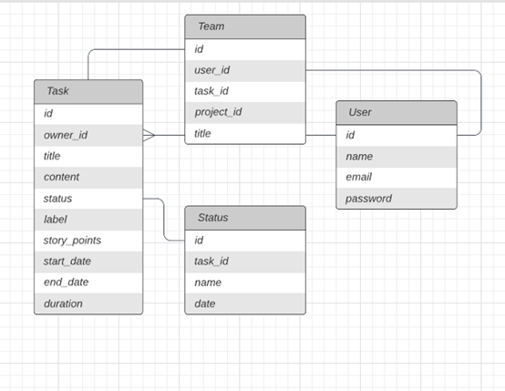

# Scrum App
  Prototyp aplikacji do zarządzania zadaniami na podstawie zwinnej metodyki Scrum. <br>
  Do utworzenia aplikacji zostały wykorzystane następujące technologie: <br>
  * Backend - .Net Rest API
  * Frontend - React
    
## Spis treści
* [Informacje ogólne](#Informacje-ogólne)
* [Dokumentacja](#Dokumentacja)
* [Technologia](#Technologie)
* [Przykład kodu](#Przykład-kodu)
* [Wymagania](#Wymagania)
  
## Informacje ogólne
Aplikacja pozwala wykonywać operacje CRUD na zadaniach w celu stworzenia listy zadań w Backlogu.
Na interfejsie zostały zaimplementowane widoki sprintu oraz logowania i rejestracji.

## Dokumentacja
Widok ekranu Rejestru Produktu
<br>
Widok ekranu logowania
<br>
Diagram związków encji.<br>


## Technologie
Frontend - React   
Backend -.Net Web API   
Backend Framework - .NET 6   
Wykorzystana baza - lokalna Ms SQL   <br><br>
Użyte paczki:
* Microsoft.EntityFrameworkCore.Design
* Microsoft.EntityFrameworkCore.SqlServer
* Microsoft.EntityFrameworkCore 
  
## Przykład kodu
* Metoda GetAll w kontrolerze TaskController
```csharp
[HttpGet]
public async Task<ActionResult<List<ScrumTask>>> Get()
{
    var tasks = await _dataContext.ScrumTask.ToListAsync();
    var result = tasks.OrderByDescending(x => x.Id);

    return Ok(result);
}
```
* Metoda GetById w kontrolerze TaskController
```csharp
[HttpGet("{id}")]
public async Task<ActionResult<List<ScrumTask>>> Get(int id)
{
    var task = await _dataContext.ScrumTask.FindAsync(id);

    if (task == null) return BadRequest("Task not found");
   
    return Ok(task);
}
```
* Metoda Add w kontrolerze TaskController
```csharp
[HttpPost]
public async Task<ActionResult<List<ScrumTask>>> AddTask(ScrumTask task)
{
    _dataContext.ScrumTask.Add(task);
    await _dataContext.SaveChangesAsync();

    return Ok(await _dataContext.ScrumTask.ToListAsync());
}
```
* Metoda Update w kontrolerze TaskController
```csharp
[HttpPut("{id}")]
public async Task<ActionResult<List<ScrumTask>>> UpdateTask(int id, ScrumTask request)
{
    var task = await _dataContext.ScrumTask.FindAsync(id);
    if (task == null) return BadRequest("Task not found");

    request.Id = id;
    _dataContext.Entry(task).CurrentValues.SetValues(request);

    await _dataContext.SaveChangesAsync();

    return Ok(await _dataContext.ScrumTask.ToListAsync());
}
```
* Dodanie routingu do aplikacji z wykorzystaniem react-router-dom z odnośnikami do odpowiednich komponentów.
```JSX
<BrowserRouter>
    <Navbar />
    <Routes>
      <Route path="/" element={<Backlog/>}/>
    </Routes>
    <Routes>
      <Route path="/sprint" element={<Sprint/>}/>
    </Routes>
    <Routes>
      <Route path="/retro" element={<Retro/>}/>
    </Routes>
    <Routes>
      <Route path="/login" element={<Login/>}/>
    </Routes>
    <Routes>
      <Route path="/Signup" element={<Signup/>}/>
    </Routes>
  <div class="footer">
    <Footer />
  </div>
</BrowserRouter>
```
* Wyświetlanie zadań w Backlogu:
```JSX
   {(tasks.length !== 0)
      ? tasks.map((task) => (
        <tr>
          <th key={task.id} scope="row">{task.id}</th>
          <td>
            <input type="text" placeholder={task.title} name="title" onChange={handleChange}/>
          </td>
          <td>{task.content}</td>
          <td>{task.status}</td>
          <td>not set</td>
          <td>{task.storyPoint}</td>
          <td>
            <button onClick={()=>editTask(task.id)} className="btn btn-success">
              Edit
            </button>
          </td>
          <td>
            <button onClick={()=>deleteTask(task.id)} className="btn btn-success">
              Del
            </button>
          </td>
        </tr>
      ))
      :<div class="d-flex justify-content-center">
        <font color="red">Something went wrong</font>
      </div>
  }
```

## Wymagania
* Zarządzanie zadaniami w Rejestrze Produktu - aplikacja umożliwia tworzenie, edycję i usuwanie zadań.
* Aplikacja umożliwia określenie priorytetów dla zadań i śledzenia ich postępu.
* Rejestr Produktu zawiera wymagania w postaci historyjki użytkownika, priorytet, status, podsumowanie oraz wagę wyrażoną w postaci punktów (ang. story points).
